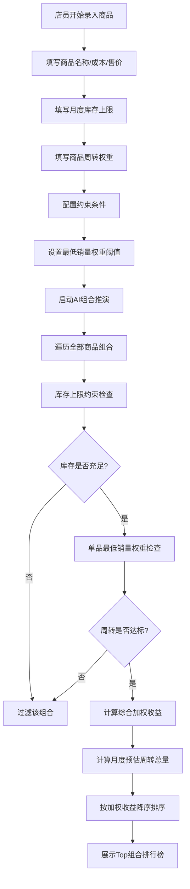

## 1. 产品概述
零食商品组合收益推演系统 - 面向零售店店员的智能选品工具，通过输入商品参数自动计算最优商品组合方案，最大化月度毛利收益。
- 解决人工选品凭经验、库存周转低效、组合搭配不科学的问题
- 核心价值：AI算力驱动的组合推演 + 多约束智能筛选 + 加权收益排序，显著提升门店运营效率

## 2. 核心功能

### 2.1 用户角色
| 角色 | 注册方式 | 核心权限 |
|------|----------|----------|
| 门店店员 | 无需注册，直接使用 | 录入商品参数、配置约束条件、查看推演结果 |

### 2.2 功能模块
1. **商品参数配置区（8874/3874型号）**: 商品录入表单、参数编辑、商品增删管理
2. **约束条件配置区**: 库存上限约束、单品最低销量权重阈值
3. **AI组合推演引擎**: 全组合遍历、多约束筛选过滤
4. **加权收益排序**: 综合加权收益计算、从高到低排序
5. **结果展示区**: Top组合列表展示、月度预估周转总量输出、实时重算刷新

### 2.3 页面详情
| 页面名称 | 模块名称 | 功能描述 |
|-----------|-------------|---------------------|
| 主页面 | 商品参数配置卡片 | 录入商品名称、进货成本、售价、月度库存上限、商品周转权重，支持8874/3874两大型号参数页签切换 |
| 主页面 | 约束条件配置面板 | 设置单品最低销量权重阈值、组合商品数量范围、全局库存总上限 |
| 主页面 | 推演控制区 | 一键启动AI推演、重置参数、显示推演进度 |
| 主页面 | 最优组合排行榜 | 展示筛选后的组合方案卡片，按综合加权收益降序排列，显示每套组合毛利、周转总量、各商品数量 |
| 主页面 | 实时联动反馈 | 修改任意单品参数后，结果区实时重算刷新，无需手动触发 |

## 3. 核心流程
用户录入商品基础参数 → 配置约束筛选条件 → 系统实时/手动触发AI推演 → 遍历全部商品搭配组合 → 叠加库存上限+单品最低销量权重双约束过滤 → 计算剩余方案综合加权收益 → 按收益从高到低排序 → 输出Top组合列表及月度预估周转总量

## 4. 用户界面设计

### 4.1 设计风格
- **主色调**: 深空灰 (#0f172a) + 琥珀金 (#f59e0b) 点缀，商业智能仪表盘风格
- **辅助色**: 翡翠绿 (#10b981) 表示高收益，玫瑰红 (#f43f5e) 表示低周转预警
- **按钮风格**: 圆角 (rounded-xl)、微立体阴影、悬停上浮效果
- **字体**: 标题使用 "Space Grotesk" 粗体，数据展示使用 "JetBrains Mono" 等宽字体，正文使用 "Noto Sans SC"
- **布局风格**: 左右分栏卡片式布局，左侧参数配置，右侧结果展示，数据仪表盘风格
- **图标风格**: Lucide 线性图标，琥珀金色点缀

### 4.2 页面设计概述
| 页面名称 | 模块名称 | UI元素 |
|-----------|-------------|-------------|
| 主页面 | 顶部导航栏 | Logo标题、型号切换Tab (8874/3874)、实时状态指示器 |
| 主页面 | 左侧参数配置区 | 商品录入表单卡片 (成本/售价/库存/权重 四大输入框)、商品列表、约束条件滑块、全局操作按钮 |
| 主页面 | 右侧结果展示区 | 推演统计概览卡片、Top组合排行榜 (卡片式列表、收益高亮条、周转量环形图)、详细参数表格 |
| 主页面 | 微交互动效 | 输入框聚焦发光、卡片悬停上浮、数据刷新数字滚动动画、排序过渡动画 |

### 4.3 响应性
- Desktop-first 设计，主断点 1280px / 1024px / 768px
- ≥1280px: 左右两栏黄金分割 (左38% 右62%)
- 768px~1280px: 左右两栏等宽缩放
- ＜768px: 上下堆叠布局，参数区在上，结果区在下
- 所有数字输入框支持触屏键盘优化
