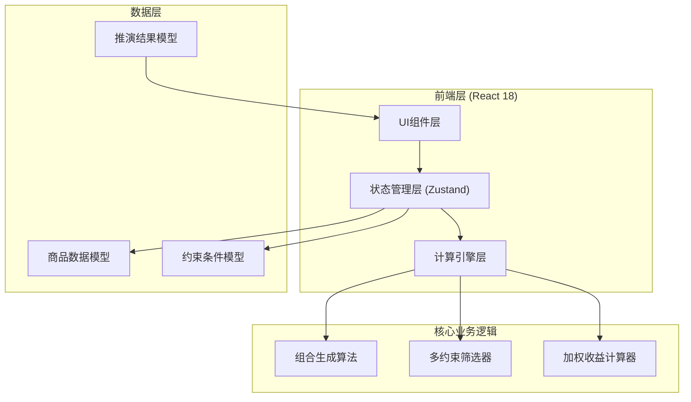

## 1. 架构设计



## 2. 技术描述
- **前端框架**: React@18 + TypeScript + Vite
- **样式方案**: TailwindCSS@3 + CSS自定义属性
- **状态管理**: Zustand (全局商品参数、约束条件、推演结果状态)
- **初始化工具**: vite-init (react-ts 模板)
- **后端服务**: 无（纯前端计算，算法在浏览器端执行）
- **图标库**: lucide-react
- **数据库**: 无（本地状态管理，可导出JSON）

## 3. 路由定义
| 路由 | 用途 |
|-------|---------|
| / | 主页面 - 商品配置 + 推演结果完整视图 |

## 4. 数据模型

### 4.1 核心类型定义

```typescript
// 商品型号
type ModelType = '8874' | '3874';

// 商品定义
interface Product {
  id: string;
  name: string;
  model: ModelType;
  cost: number;           // 进货成本
  price: number;          // 售价
  stockLimit: number;     // 月度库存上限
  turnoverWeight: number; // 商品周转权重 (1-10)
}

// 约束条件
interface Constraints {
  minTurnoverWeight: number;     // 单品最低销量权重阈值
  minComboSize: number;          // 组合最小商品数
  maxComboSize: number;          // 组合最大商品数
  globalStockLimit: number;      // 全局库存总上限 (0表示不限制)
}

// 组合中的商品及配量
interface ComboItem {
  product: Product;
  quantity: number;
}

// 推演组合方案
interface ComboResult {
  id: string;
  rank: number;
  items: ComboItem[];
  totalCost: number;           // 组合总成本
  totalRevenue: number;        // 组合总收入
  grossProfit: number;         // 组合毛利
  profitMargin: number;        // 毛利率
  weightedScore: number;       // 综合加权收益分
  monthlyTurnover: number;     // 月度预估周转总量
  avgTurnoverWeight: number;   // 平均周转权重
  totalStock: number;          // 总占用库存
}

// 推演统计摘要
interface CalculationSummary {
  totalCombinations: number;   // 遍历总组合数
  filteredByStock: number;     // 库存约束过滤数
  filteredByWeight: number;    // 周转权重过滤数
  validCombinations: number;   // 有效组合数
  calculateTimeMs: number;     // 计算耗时
}

// 全局应用状态
interface AppState {
  products: Product[];
  activeModel: ModelType;
  constraints: Constraints;
  results: ComboResult[];
  summary: CalculationSummary | null;
  isCalculating: boolean;
}
```

### 4.2 算法设计

#### 4.2.1 组合生成算法
- 输入: N个商品, 组合大小范围 [minComboSize, maxComboSize]
- 输出: 所有满足条件的商品子集组合
- 优化: 采用回溯法生成组合, 剪枝策略避免重复计算

#### 4.2.2 多约束筛选器
```
约束1 - 库存上限约束:
  对每个组合内各商品, 假设周转权重决定销量比例, 
  ∑(商品配量) ≤ 该商品月度库存上限
  ∑(全部商品总配量) ≤ 全局库存总上限 (如启用)

约束2 - 单品最低销量权重约束:
  组合内所有商品的周转权重 ≥ minTurnoverWeight
  组合平均周转权重 ≥ 阈值的110% (优质组合筛选)
```

#### 4.2.3 综合加权收益公式
```
加权收益分 = (毛利 × 0.50) 
           + (毛利率 × 100 × 0.20) 
           + (平均周转权重 × 0.15)
           + (月度周转总量 × 0.10)
           + (库存利用率 × 0.05)

其中:
- 库存利用率 = 总占用库存 / 全局库存上限
- 各维度权重可根据实际业务微调
```

## 5. 项目文件结构
```
e:\solo\lj0094\
├── src\
│   ├── components\
│   │   ├── layout\
│   │   │   ├── Header.tsx           # 顶部导航+型号切换
│   │   │   └── MainLayout.tsx       # 主布局容器
│   │   ├── product\
│   │   │   ├── ProductForm.tsx      # 商品参数录入表单
│   │   │   └── ProductList.tsx      # 已录入商品列表
│   │   ├── constraints\
│   │   │   └── ConstraintsPanel.tsx # 约束条件配置面板
│   │   ├── results\
│   │   │   ├── SummaryCard.tsx      # 推演统计摘要
│   │   │   ├── ComboCard.tsx        # 组合方案卡片
│   │   │   └── RankingList.tsx      # 排行榜列表
│   │   └── common\
│   │       ├── NumberInput.tsx      # 数字输入框组件
│   │       ├── SliderInput.tsx      # 滑块输入组件
│   │       └── StatBadge.tsx        # 数据徽章组件
│   ├── hooks\
│   │   ├── useCalculator.ts         # 组合推演计算Hook
│   │   └── useDebounce.ts           # 防抖Hook (实时重算)
│   ├── store\
│   │   └── useAppStore.ts           # Zustand全局状态
│   ├── utils\
│   │   ├── calculator.ts            # 核心算法: 组合+筛选+排序
│   │   ├── combinatorics.ts         # 组合生成工具
│   │   └── formatters.ts            # 数字/货币格式化
│   ├── types\
│   │   └── index.ts                 # 全局TypeScript类型
│   ├── data\
│   │   └── mockData.ts              # 初始示例商品数据
│   ├── pages\
│   │   └── HomePage.tsx             # 主页
│   ├── App.tsx
│   ├── main.tsx
│   └── index.css
├── index.html
├── package.json
├── vite.config.ts
├── tailwind.config.js
├── tsconfig.json
└── postcss.config.js
```

## 6. 关键实现要点

### 6.1 实时重算机制
- 使用 `useDebounce` Hook 对商品参数和约束条件变更进行 300ms 防抖
- 防抖触发后自动调用推演引擎, 更新结果区
- 计算过程中显示 loading 骨架屏状态

### 6.2 大数据量性能优化
- 商品数量 ≤ 15 个: 全组合遍历
- 商品数量 ＞ 15 个: 自动启用启发式搜索 (贪心 + 局部最优剪枝)
- 使用 Web Worker 进行计算, 避免阻塞主线程 UI 响应

### 6.3 8874/3874 型号隔离
- Zustand Store 中 products 按 model 字段分类存储
- 型号切换时仅加载对应型号商品数据
- 约束条件可按型号独立配置
